# 6. Database Design

**Status:** Draft · **Owner:** Hillary

## 6.1 Overview

One PostgreSQL 16 database per environment, one shared schema (`public`), every tenant's
rows in the same tables, isolated by row-level security (ADR-003). Money is integer minor
units and every financial event posts to a double-entry general ledger (ADR-004).

This chapter is the logical data model the migrations implement. It is written in
PostgreSQL types. The physical schema is owned by Flyway SQL migrations in
`backend/src/main/resources/db/migration` (ADR-010), applied as `bms_owner` by the one-shot
migrate container (ADR-006); section 6.9 lists which tables exist so far. A schema drift test
will compare the migrated database with this chapter's table list.

Requirement IDs in the Notes columns point to chapter 3.

## 6.2 Conventions

### 6.2.1 Naming

- Tables are plural snake case. Core tables have no prefix. Tables owned by a vertical
  module are prefixed with the module key: `lending_members`, `lending_loans`.
- Money columns end in `_minor` (`bigint`, minor units) and sit next to a `currency
  char(3)` column on the same row. The only exception is `journal_lines.debit` and
  `journal_lines.credit` (ADR-004).
- Rate columns end in `_bp` (`integer`, basis points).
- Foreign key columns end in `_id`. User references end in `_by` (`created_by`) or
  `_user_id`.
- Enumerations are `text` with a `CHECK (col IN (...))` constraint, not native enum
  types, so adding a value is a plain migration. The allowed values are listed in this
  chapter in square brackets.

### 6.2.2 Standard columns

Every tenant-owned table carries these unless stated otherwise. Tables below list only
their own columns and say "(std)".

| Column | Type | Notes |
|---|---|---|
| `id` | `uuid` | Primary key, generated by the application (UUID v4 or v7). |
| `tenant_id` | `uuid NOT NULL` | FK `tenants(id)`. RLS key. Leads every index. |
| `created_at` | `timestamptz NOT NULL DEFAULT now()` | UTC. |
| `updated_at` | `timestamptz` | Set on every update. Absent on append-only tables. |
| `version` | `integer NOT NULL DEFAULT 1` | Optimistic concurrency on mutable master data (chapter 7 section 7.9). Absent on append-only tables. |

And these constraints:

- `UNIQUE (tenant_id, id)`, so children can reference `(tenant_id, x_id)`.
- Every reference to another tenant-owned table is a composite foreign key
  `FOREIGN KEY (tenant_id, x_id) REFERENCES x (tenant_id, id)`. A row can therefore never
  point at another tenant's row, independently of RLS (ADR-003).
- Branch-owned tables carry `branch_id uuid NOT NULL` with
  `FOREIGN KEY (tenant_id, branch_id) REFERENCES branches (tenant_id, id)`.

### 6.2.3 Dates and times

Business dates (due dates, value dates, entry dates) are `date`, interpreted in the
tenant's timezone (`tenants.timezone`, default `Africa/Kampala`). Event instants are
`timestamptz`, stored in UTC.

### 6.2.4 Append-only tables

`audit_log`, `platform_audit_log`, `journal_entries`, `journal_lines`,
`lending_loan_status_history`, `lending_loan_transactions`,
`lending_repayment_allocations`, `lending_collateral_events`,
`lending_collection_actions` (except `promise_status`), `lending_savings_transactions`,
`lending_investment_transactions`, `import_issue_resolutions`.

For these the application role is granted `SELECT, INSERT` only, and a trigger
`reject_mutation()` raises on `UPDATE` or `DELETE` for every role, `bms_owner` included,
except in a migration running as `bms_owner` that opts in with
`SET LOCAL bms.allow_mutation = 'on'`. The helper `bms_make_append_only(table)` attaches it. `lending_collection_actions.promise_status` is the one
updatable column, granted by column.

## 6.3 Row-level security and database roles

### 6.3.1 Roles

| Role | Login | Used by | Rights |
|---|---|---|---|
| `bms_owner` | yes | Migrations, backup (`pg_dump`), restore, onboarding scripts | `NOSUPERUSER BYPASSRLS`. Owns the database, the schema, every table and function. `BYPASSRLS` is required because every table is `FORCE ROW LEVEL SECURITY`: without it `pg_dump` and the `SECURITY DEFINER` resolvers would be filtered by the policy too. Never used by the running API or worker. |
| `bms_app` | yes | API and worker | `NOSUPERUSER NOBYPASSRLS`. DML per table as granted by migrations. Subject to RLS. |
| `bms_platform` | yes | Platform console endpoints on the platform host | Read and write on platform tables (6.4); no access to tenant-owned tables except through the audited support session path (FR-TEN-07). Not created yet: until it is, the platform console runs as `bms_app` and changes tenancy tables only through the platform `SECURITY DEFINER` functions of section 6.3.2 (ADR-016). |

`bms_owner` and `bms_app` are created by `deploy/postgres/initdb/01-roles.sh` when the database
volume is first initialised, on servers, in `make dev` and in the integration tests alike. The
API refuses to start if its database user owns any application table, is a superuser or has
`rolbypassrls` (NFR-SEC-03; `DatabaseRoleGuard`).

### 6.3.2 Policy pattern

Applied by the shared migration helper `bms_apply_tenant_rls(table, key default 'tenant_id')`
to every tenant-owned table, and to nothing else; privileges come from
`bms_grant_app(table, 'SELECT, INSERT, ...')`:

```sql
ALTER TABLE <table> ENABLE ROW LEVEL SECURITY;
ALTER TABLE <table> FORCE ROW LEVEL SECURITY;
CREATE POLICY tenant_isolation ON <table>
  USING (tenant_id = current_setting('app.tenant_id')::uuid)
  WITH CHECK (tenant_id = current_setting('app.tenant_id')::uuid);
```

The `tenants` table has the same policy on `id` instead of `tenant_id`.

Each transaction binds its tenant first:

```sql
SELECT set_config('app.tenant_id', $1, true);   -- true: transaction-local
```

In the application this happens in exactly one place: the transaction manager
(`TenantBindingTransactionManager`) runs it on the transaction's connection when every
Spring-managed transaction begins, with the tenant the request's host resolved to. Nothing
else sets it, so no code path can open a transaction for a different tenant, and a statement
outside a transaction has no tenant at all. Inserts take `tenant_id` from
`current_setting('app.tenant_id')::uuid` rather than from a Java value.

With no tenant bound, a query fails: a session that never set the parameter raises
`unrecognized configuration parameter "app.tenant_id"`, and a pooled session where a previous
transaction set it raises `invalid input syntax for type uuid: ""` (the transaction-local value
has reverted to empty). Both are errors, never rows (NFR-ISO-03). A table with no rows returns
none either way, because the policy is only evaluated against rows.

Two `SECURITY DEFINER` functions, owned by `bms_owner`, with
`SET search_path = public, pg_temp`, are the only sanctioned way around the policy:

```sql
-- Returns the id of an ACTIVE tenant with this slug, or NULL. Nothing else.
CREATE FUNCTION app_resolve_tenant(p_slug text) RETURNS uuid ...;
-- Returns the ids of active tenants, for scheduled jobs.
CREATE FUNCTION app_list_active_tenants() RETURNS SETOF uuid ...;
```

Migration V2 adds two more of the same kind: `app_resolve_tenant_status(slug)` returns the id and
status of an active or suspended tenant, for request-time resolution (a suspended tenant is
served read only, FR-TEN-06), and `app_list_active_tenants_with_module(module)` returns the
active tenants with a module switched on, for a vertical's jobs (FR-TEN-03).

The platform functions `platform_create_tenant`, `platform_set_tenant_modules`,
`platform_set_subscription_status` and `platform_list_tenants` (also `SECURITY DEFINER`, owned by
`bms_owner`) are the only way the application changes `tenants`, `tenant_modules` and
`subscriptions`, which stay SELECT-only for `bms_app` (ADR-016).

A third resolver, for gateway callbacks (chapter 12), returns only `(tenant_id, intent_id)` for a
provider reference:

```sql
CREATE FUNCTION app_resolve_payment_intent(p_provider text, p_reference text)
  RETURNS TABLE (tenant_id uuid, intent_id uuid) ...;
```

### 6.3.3 Branch scope

Branch scope is authorisation, applied by the data access layer from the principal's
role assignments (ADR-003). Every list query on a branch-owned table takes the
principal's branch set and adds `branch_id = ANY($branches)` unless the principal's scope
is "all branches". A test per list endpoint proves a branch-scoped user cannot see
another branch's rows (chapter 15).

## 6.4 Platform and reference tables (no `tenant_id`)

### `currencies` (reference, no RLS, `bms_app` SELECT only)

| Column | Type | Notes |
|---|---|---|
| `code` | `char(3)` PK | ISO 4217. Seeded: `UGX` (exponent 0), `KES` (2), `TZS` (2), `USD` (2). |
| `exponent` | `smallint NOT NULL` | Minor unit digits. |
| `name` | `text NOT NULL` | |

### `plans` (reference, no RLS, `bms_app` SELECT only)

| Column | Type | Notes |
|---|---|---|
| `id` | `uuid` PK | |
| `code` | `text UNIQUE NOT NULL` | For example `starter`, `growth`, `institution`. |
| `name` | `text NOT NULL` | |
| `max_branches` | `integer` | NULL = unlimited. FR-TEN-04. |
| `max_staff_users` | `integer` | NULL = unlimited. |
| `max_active_members` | `integer` | NULL = unlimited. |
| `allowed_modules` | `text[] NOT NULL` | For example `{lending}`. |
| `is_active` | `boolean NOT NULL DEFAULT true` | |

Prices are commercial and are not stored in this repository's seed data.

### `permissions`, `roles`, `role_permissions` (reference, no RLS, `bms_app` SELECT only)

| Table | Columns |
|---|---|
| `permissions` | `key text PK` (format `<module>.<resource>.<action>`, for example `lending.loans.approve`), `module text NOT NULL`, `description text NOT NULL`, `is_money_moving boolean NOT NULL` |
| `roles` | `key text PK` [`tenant_admin`, `branch_manager`, `loan_officer`, `cashier`, `accountant`, `auditor`, `member`], `name text NOT NULL`, `kind text NOT NULL` [`staff`, `member`], `mfa_required boolean NOT NULL DEFAULT false` (true for `tenant_admin`, FR-IAM-06) |
| `role_permissions` | `role_key text FK roles`, `permission_key text FK permissions`, PK both |

Seeded from the matrix in chapter 8 by migration V2, with the two platform permissions
(`platform.tenants.read`, `platform.tenants.manage`) that no role holds. Custom tenant roles are
`Later`.

### `platform_users` (`bms_platform` only; `bms_app` until then, ADR-016)

`id uuid PK`, `email varchar(320) NOT NULL` (unique on `lower(email)`), `full_name text NOT NULL`,
`password_hash text` (argon2id; NULL until the operator uses the setup token),
`totp_secret_enc bytea` and `totp_pending_secret_enc bytea` (encrypted with the application data
key; MFA is mandatory and enrolled at first sign-in), `totp_last_step bigint`,
`mfa_enabled boolean NOT NULL DEFAULT false`, `is_active boolean NOT NULL DEFAULT true`,
`failed_login_count integer NOT NULL DEFAULT 0`, `locked_until timestamptz`,
`setup_token_hash char(64) UNIQUE`, `setup_token_expires_at timestamptz`, `created_at`,
`updated_at`, `last_login_at`.

### `platform_sessions` and `platform_user_recovery_codes` (platform)

`platform_sessions` has the columns of `auth_sessions` with `platform_user_id` in place of
`tenant_id` and `user_id`. `platform_user_recovery_codes`: `id uuid PK`,
`platform_user_id uuid NOT NULL` FK, `code_hash char(64) NOT NULL`, `used_at timestamptz`,
`created_at`.

Until the `bms_platform` role exists, `bms_app` holds the grants on the platform tables
(`platform_audit_log`: SELECT and INSERT only) and no tenant endpoint reads them (ADR-016).

### `platform_audit_log` (`bms_platform` INSERT and SELECT only, append-only; `bms_app` until then, ADR-016)

`id uuid PK`, `occurred_at timestamptz`, `platform_user_id uuid`, `action text`,
`tenant_id uuid NULL` (not a FK, survives tenant deletion), `data jsonb`, `request_id text`,
`ip inet`.

### `unmatched_gateway_callbacks` (`bms_platform` and `bms_app` INSERT; `bms_platform` SELECT)

`id uuid PK`, `received_at timestamptz`, `provider text`, `provider_reference text`,
`headers jsonb`, `body jsonb`, `signature_valid boolean`, `handled_at timestamptz`,
`note text`. Callbacks whose reference resolves to no intent (chapter 12).

## 6.5 Core tenant-owned tables

### `tenants` (RLS on `id`; `bms_app` SELECT only; written by the platform functions, ADR-016)

| Column | Type | Notes |
|---|---|---|
| `id` | `uuid` PK | |
| `slug` | `varchar(63) UNIQUE NOT NULL` | `CHECK (slug ~ '^[a-z0-9]([a-z0-9-]{1,61}[a-z0-9])$')`; reserved labels refused by the service (FR-TEN-02). |
| `name` | `text NOT NULL` | |
| `status` | `text NOT NULL` | [`active`, `suspended`]. FR-TEN-06. |
| `currency` | `char(3) NOT NULL` | FK `currencies`. Default `UGX`. |
| `timezone` | `text NOT NULL` | Default `Africa/Kampala`. |
| `plan_id` | `uuid NOT NULL` | FK `plans`. |
| `created_at`, `updated_at` | | |

### `subscriptions` (RLS; `bms_app` SELECT only)

(std, no `version`) `plan_id uuid NOT NULL`, `status text NOT NULL` [`trial`, `active`,
`past_due`, `suspended`, `cancelled`], `current_period_start date`,
`current_period_end date`, `trial_ends_on date`, `next_status_change_on date`,
`updated_by_platform_user_id uuid`. One current row per tenant
(`UNIQUE (tenant_id)`); history is in `platform_audit_log`.

### `tenant_modules` (RLS; `bms_app` SELECT only)

`tenant_id uuid`, `module_key text` [`lending`, `retail`], `enabled_at timestamptz`,
`enabled_by_platform_user_id uuid`. PK `(tenant_id, module_key)`. FR-TEN-03.

### `tenant_settings` (RLS)

(std) `settings jsonb NOT NULL`, `UNIQUE (tenant_id)`. The JSON holds only the keys a tenant
admin has set, validated against a typed schema in the service; every read applies the defaults
below to the rest. A tenant without a row reads all defaults. Keys and defaults:

| Key | Type | Default | Requirement |
|---|---|---|---|
| `display_name` | string | tenant name | FR-TEN-08 |
| `logo_document_id` | uuid or null | null | FR-TEN-08 |
| `receipt_footer` | string | empty | FR-DOC-01 |
| `sms_sender_name` | string or null | null (aggregator default) | FR-NTF-02 |
| `sms_window_start`, `sms_window_end` | `HH:MM` | `08:00`, `20:00` | FR-NTF-04 |
| `approval_thresholds_minor` | map of action type to integer | every action 0 | FR-APR-04 |
| `approval_validity_days` | integer | 14 | FR-ORG-08 |
| `allow_loans_before_kyc_verified` | boolean | false | FR-MEM-05 |
| `max_active_loans_per_member` | integer or null | null | FR-ORG-07 |
| `appraisal_weights` | object | section 3.18.1 defaults | FR-ORG-04 |
| `disabled_collateral_types` | string array | empty | FR-COL-05 |
| `require_mfa_all_staff` | boolean | false | FR-IAM-06 |

### `branches` (RLS)

(std) `code varchar(10) NOT NULL` (`CHECK (code ~ '^[A-Z0-9]{2,10}$')`),
`name text NOT NULL`, `location text`, `is_head_office boolean NOT NULL DEFAULT false`,
`status text NOT NULL` [`active`, `inactive`].
`UNIQUE (tenant_id, code)`; partial unique index
`ON branches (tenant_id) WHERE is_head_office` (exactly one head office). FR-BR-01.

### `users` (RLS)

(std) `kind text NOT NULL` [`staff`, `member`], `full_name text NOT NULL`,
`email varchar(320)`, `phone_e164 varchar(16)`, `status text NOT NULL` [`invited`,
`active`, `deactivated`], `failed_login_count integer NOT NULL DEFAULT 0`,
`locked_until timestamptz`, `mfa_enabled boolean NOT NULL DEFAULT false`,
`last_login_at timestamptz`.
Partial unique `(tenant_id, lower(email)) WHERE email IS NOT NULL AND kind = 'staff'`;
partial unique `(tenant_id, phone_e164) WHERE kind = 'member'`.
`CHECK (email IS NOT NULL OR phone_e164 IS NOT NULL)`.

### `user_credentials` (RLS)

`user_id uuid PK` (FK `(tenant_id, user_id)`), `tenant_id uuid NOT NULL`,
`password_hash text` (argon2id; staff), `pin_hash text` (argon2id; members),
`totp_secret_enc bytea` (encrypted with the application data key),
`totp_pending_secret_enc bytea` (issued by enrolment, not yet confirmed), `totp_last_step bigint`
(a TOTP code is accepted once), `password_changed_at timestamptz`,
`pin_failed_count integer NOT NULL DEFAULT 0`, `pin_locked_until timestamptz`, `updated_at`.
Never returned by any endpoint.

### `user_recovery_codes` (RLS)

`id uuid PK`, `tenant_id`, `created_at`, `user_id uuid NOT NULL` (FK `(tenant_id, user_id)`),
`code_hash char(64) NOT NULL` (SHA-256), `used_at timestamptz`. Ten per enrolment, single use;
replaced as a set. FR-IAM-11.

### `user_invitations` (RLS)

(std, no `version`) `user_id uuid NOT NULL`, `token_hash char(64) NOT NULL UNIQUE`
(SHA-256 of the one-time token), `expires_at timestamptz NOT NULL` (72 hours),
`accepted_at timestamptz`, `revoked_at timestamptz` (a newer invitation replaced it),
`invited_by uuid NOT NULL` (a staff user, or the platform operator who created the tenant; no
foreign key).

### `auth_sessions` (RLS)

(std, no `version`) `user_id uuid NOT NULL`, `family_id uuid NOT NULL`,
`refresh_token_hash char(64) NOT NULL UNIQUE`, `expires_at timestamptz NOT NULL`,
`idle_expires_at timestamptz NOT NULL`, `rotated_at timestamptz`,
`revoked_at timestamptz`, `revoked_reason text` [`sign_out`, `rotation_reuse`,
`user_deactivated`, `admin`, `mfa_reset`], `ip inet`, `user_agent text`.
One row per refresh token: a rotation marks the row `rotated_at` and inserts the next row of the
same family; the access token's `sid` is the row id.
Index `(tenant_id, user_id) WHERE revoked_at IS NULL`. FR-IAM-07, FR-IAM-08.

### `otp_challenges` (RLS)

(std, no `version`) `phone_e164 varchar(16) NOT NULL`, `purpose text NOT NULL`
[`member_activation`, `pin_reset`], `code_hash char(64) NOT NULL`,
`expires_at timestamptz NOT NULL`, `attempts smallint NOT NULL DEFAULT 0`,
`consumed_at timestamptz`. FR-IAM-09.

### `user_role_assignments` (RLS)

(std) `user_id uuid NOT NULL`, `role_key text NOT NULL` (FK `roles`),
`branch_id uuid` (NULL = all branches of the tenant), `granted_by uuid NOT NULL`,
`revoked_at timestamptz`, `revoked_by uuid`.
Partial unique `(tenant_id, user_id, role_key, coalesce(branch_id, '00000000-0000-0000-0000-000000000000'::uuid)) WHERE revoked_at IS NULL`.

### `audit_log` (RLS, append-only)

| Column | Type | Notes |
|---|---|---|
| `id`, `tenant_id`, `created_at` | | `created_at` is the event time. |
| `actor_user_id` | `uuid` | NULL for system jobs. |
| `actor_kind` | `text NOT NULL` | [`staff`, `member`, `system`, `platform`] |
| `branch_id` | `uuid` | |
| `action` | `varchar(100) NOT NULL` | `<module>.<entity>.<verb>`, for example `lending.loan.approved`. |
| `entity_type` | `varchar(100) NOT NULL` | |
| `entity_id` | `uuid` | |
| `request_id` | `varchar(64)` | Correlates with logs. |
| `ip` | `inet` | |
| `data` | `jsonb NOT NULL DEFAULT '{}'` | `{"before": {...}, "after": {...}}` with NIN and phone masked (FR-AUD-05). |

Indexes: `(tenant_id, created_at DESC)`, `(tenant_id, entity_type, entity_id)`,
`(tenant_id, actor_user_id, created_at DESC)`.

### `approval_requests` (RLS)

| Column | Type | Notes |
|---|---|---|
| (std) | | |
| `branch_id` | `uuid NOT NULL` | |
| `action_type` | `text NOT NULL` | `CHECK (action_type ~ '^[a-z][a-z0-9_]{2,62}$')`. The values are the action types of chapter 8 section 8.4, each registered by the module that owns it; the registry, not the database, refuses an unknown type (ADR-015). |
| `subject_type` | `text NOT NULL` | For example `lending.loan`. |
| `subject_id` | `uuid NOT NULL` | |
| `amount_minor` | `bigint` | For threshold rules and the queue display. |
| `currency` | `char(3)` | |
| `payload` | `jsonb NOT NULL` | Snapshot executed on approval (FR-APR-08). |
| `subject_version` | `integer` | Subject's `version` when requested; mismatch on approve marks `stale`. |
| `status` | `text NOT NULL` | [`pending`, `approved`, `rejected`, `cancelled`, `expired`, `stale`] |
| `requested_by` | `uuid NOT NULL` | |
| `requested_at` | `timestamptz NOT NULL` | |
| `expires_at` | `timestamptz NOT NULL` | `requested_at + 7 days`. |
| `decided_by` | `uuid` | |
| `decided_at` | `timestamptz` | |
| `decision_note` | `text` | Required when `rejected`. |
| `execution_error` | `text` | Last failed execution attempt (FR-APR-06). |

`CONSTRAINT approval_checker_is_not_maker CHECK (decided_by IS NULL OR decided_by <> requested_by)`
(FR-APR-02); a rejection needs a note; `amount_minor` and `currency` are both set or both NULL.
A cancellation sets `decided_at` but not `decided_by`. Partial unique
`(tenant_id, action_type, subject_id) WHERE status = 'pending'`: one pending request per
action and subject.

### `tenant_sequences` (RLS)

`tenant_id uuid`, `sequence_key text` (for example `member_no`, `loan_no`,
`journal_no`, `receipt:<branch_code>`, `voucher:<branch_code>`, `savings_no`,
`investment_no`), `next_value bigint NOT NULL DEFAULT 1`. PK `(tenant_id, sequence_key)`.
Numbers are taken with `UPDATE ... SET next_value = next_value + 1 RETURNING next_value - 1`
in the business transaction, so they are gap-free (FR-DOC-04).

### `idempotency_keys` (RLS)

| Column | Type | Notes |
|---|---|---|
| `tenant_id` | `uuid NOT NULL` | |
| `principal_id` | `uuid NOT NULL` | User id, or the gateway adapter's fixed id for callbacks. |
| `key` | `varchar(100) NOT NULL` | Client-supplied `Idempotency-Key`. |
| `method`, `path` | `text NOT NULL` | |
| `request_hash` | `char(64) NOT NULL` | SHA-256 of the canonical JSON body. |
| `status` | `text NOT NULL` | [`in_progress`, `completed`] |
| `response_status` | `smallint` | |
| `response_body` | `jsonb` | |
| `created_at` | `timestamptz NOT NULL` | |
| `expires_at` | `timestamptz NOT NULL` | `created_at + 7 days`; purged nightly. |

PK `(tenant_id, principal_id, key)`. Behaviour in chapter 7 section 7.8.

### `outbox_events` (RLS)

(std, no `version`) `event_type text NOT NULL` (for example `notification.send`,
`document.render`, `report.build`), `payload jsonb NOT NULL`,
`available_at timestamptz NOT NULL DEFAULT now()`, `status text NOT NULL` [`pending`,
`processing`, `done`, `failed`], `attempts smallint NOT NULL DEFAULT 0`,
`last_error text`, `processed_at timestamptz`.
Index `(status, available_at) WHERE status = 'pending'`.
The worker's dispatcher reads pending rows across tenants through
`app_list_active_tenants()` and processes each in a transaction bound to that tenant.

### `notification_templates` (RLS)

(std) `event_key text NOT NULL` (FR-NTF-02 list), `channel text NOT NULL` [`sms`, `email`],
`locale text NOT NULL DEFAULT 'en'`, `subject text` (email), `body text NOT NULL`,
`is_active boolean NOT NULL DEFAULT true`, `updated_by uuid`.
`UNIQUE (tenant_id, event_key, channel, locale)`.

### `notifications` (RLS)

(std, no `version`) `branch_id uuid`, `channel text NOT NULL`, `recipient text NOT NULL`
(E.164 or email), `subject_type text`, `subject_id uuid`, `event_key text NOT NULL`,
`dedupe_key text NOT NULL` (for example `reminder:due_in_3:<schedule_item_id>`),
`body text NOT NULL`, `status text NOT NULL` [`queued`, `sending`, `sent`, `delivered`,
`undelivered`, `failed`, `suppressed`], `segments smallint`, `provider text`,
`provider_message_id text`, `attempts smallint NOT NULL DEFAULT 0`,
`scheduled_for timestamptz NOT NULL`, `sent_at timestamptz`,
`delivered_at timestamptz`, `last_error text`.
`UNIQUE (tenant_id, dedupe_key)` (FR-NTF-06). Index `(provider, provider_message_id)`.

### `documents` (RLS)

(std, no `version`) `branch_id uuid`, `doc_type text NOT NULL` [`receipt`, `voucher`,
`loan_agreement`, `schedule`, `loan_statement`, `member_statement`, `savings_statement`,
`investment_certificate`, `report`, `upload`], `doc_number text`,
`subject_type text`, `subject_id uuid`, `object_key text NOT NULL UNIQUE`
(`tenants/<tenant_id>/<doc_type>/<yyyy>/<mm>/<id>.<ext>`), `content_type text NOT NULL`,
`size_bytes bigint NOT NULL`, `sha256 char(64) NOT NULL`, `created_by uuid`.

### `report_runs` (RLS)

(std, no `version`) `report_key text NOT NULL`, `params jsonb NOT NULL`,
`format text NOT NULL` [`json`, `csv`, `pdf`, `xlsx`], `status text NOT NULL` [`queued`,
`running`, `ready`, `failed`], `requested_by uuid NOT NULL`, `started_at timestamptz`,
`finished_at timestamptz`, `document_id uuid`, `row_count integer`, `error text`.

### `payment_methods` (RLS)

(std) `method_key text NOT NULL` [`cash`, `bank`, `mtn_momo`, `airtel_money`, `gateway`,
`savings_transfer`], `branch_id uuid` (NULL = tenant default),
`gl_account_id uuid NOT NULL`, `is_active boolean NOT NULL DEFAULT true`.
Unique `(tenant_id, method_key, coalesce(branch_id, zero uuid))`. FR-GL-08.

### `payment_intents` (RLS)

| Column | Type | Notes |
|---|---|---|
| (std) | | |
| `branch_id` | `uuid NOT NULL` | |
| `purpose` | `text NOT NULL` | Module-defined, for example `lending.loan_repayment`, `lending.savings_deposit`, `lending.investment_funding`. |
| `subject_type`, `subject_id` | `text`, `uuid NOT NULL` | The account being paid. |
| `payer_phone_e164` | `varchar(16) NOT NULL` | |
| `amount_minor`, `currency` | | `CHECK (amount_minor > 0)` |
| `provider` | `text NOT NULL` | Adapter key (pending ADR-011). |
| `provider_reference` | `text` | Unique per provider once known. |
| `status` | `text NOT NULL` | [`created`, `pending`, `succeeded`, `failed`, `expired`] |
| `failure_reason` | `text` | |
| `initiated_by_user_id` | `uuid NOT NULL` | Member or staff user. |
| `expires_at` | `timestamptz NOT NULL` | |
| `succeeded_at` | `timestamptz` | |
| `booked_subject_txn_id` | `uuid` | The repayment or deposit created (FR-PAY-03). |

`UNIQUE (provider, provider_reference)`.

### `payment_callbacks` (RLS, append-only)

`id`, `tenant_id`, `created_at`, `intent_id uuid NOT NULL`, `provider text`,
`headers jsonb`, `body jsonb`, `signature_valid boolean NOT NULL`,
`status_query_result jsonb`, `outcome text` [`booked`, `duplicate`, `rejected`,
`status_mismatch`].

### `unallocated_receipts` (RLS)

(std) `branch_id uuid NOT NULL`, `source text NOT NULL` [`gateway`, `bank`, `cash`],
`amount_minor bigint NOT NULL`, `currency char(3) NOT NULL`, `payer_phone_e164 text`,
`reference text`, `received_on date NOT NULL`, `status text NOT NULL` [`open`,
`allocated`, `refunded`], `allocated_subject_type text`, `allocated_subject_id uuid`,
`allocated_by uuid`, `allocated_at timestamptz`, `receipt_journal_entry_id uuid NOT NULL`,
`allocation_journal_entry_id uuid`. FR-PAY-04.

### Import tables (RLS)

Specified in full in chapter 13 section 13.4; listed here for completeness:
`import_batches`, `import_rows`, `import_issues`, `import_issue_resolutions`.

## 6.6 General ledger (RLS)

### 6.6.1 Tables

#### `gl_accounts`

| Column | Type | Notes |
|---|---|---|
| (std) | | |
| `code` | `varchar(20) NOT NULL` | `UNIQUE (tenant_id, code)` |
| `name` | `varchar(200) NOT NULL` | |
| `account_type` | `text NOT NULL` | [`asset`, `liability`, `equity`, `income`, `expense`] |
| `normal_balance` | `text NOT NULL` | [`debit`, `credit`]; debit for asset and expense, credit otherwise. |
| `parent_id` | `uuid` | Header account; FK to `gl_accounts`. |
| `currency` | `char(3) NOT NULL` | Tenant currency. |
| `system_key` | `text` | Partial unique `(tenant_id, system_key) WHERE system_key IS NOT NULL`. Posting rules resolve accounts by this key. |
| `is_postable` | `boolean NOT NULL` | False for header accounts. |
| `is_system_controlled` | `boolean NOT NULL DEFAULT false` | Manual journals may not touch it (FR-GL-05). |
| `is_active` | `boolean NOT NULL DEFAULT true` | |

#### `gl_periods`

(std) `year smallint NOT NULL`, `month smallint NOT NULL` (`CHECK (month BETWEEN 1 AND 12)`),
`status text NOT NULL` [`open`, `closed`], `closed_by uuid`, `closed_at timestamptz`,
`reopened_by uuid`, `reopened_at timestamptz`, `reopen_reason text`.
`UNIQUE (tenant_id, year, month)`. Periods are created on demand for the entry date's
month; an entry into a closed period is refused (FR-GL-06).

#### `journal_entries` (append-only)

| Column | Type | Notes |
|---|---|---|
| `id`, `tenant_id`, `created_at` | | |
| `branch_id` | `uuid NOT NULL` | One branch per entry (ADR-004). |
| `entry_no` | `varchar(20) NOT NULL` | `JE` plus 8 digits from `tenant_sequences`. `UNIQUE (tenant_id, entry_no)`. |
| `entry_date` | `date NOT NULL` | Business date. |
| `period_id` | `uuid NOT NULL` | FK `gl_periods`. |
| `reference` | `varchar(100) NOT NULL` | Human reference, for example the receipt or loan number. |
| `memo` | `text` | |
| `source_module` | `varchar(50) NOT NULL` | For example `lending`, `ledger` (manual), `imports`, `payments`. |
| `source_type` | `varchar(50) NOT NULL` | For example `loan_transaction`, `savings_transaction`, `manual_journal`, `opening_balance`. |
| `source_id` | `uuid` | |
| `reverses_entry_id` | `uuid` | `UNIQUE (tenant_id, reverses_entry_id)`: an entry is reversed at most once (FR-GL-04). |
| `idempotency_key` | `varchar(100)` | Partial unique `(tenant_id, idempotency_key)`. |
| `created_by` | `uuid` | NULL for system jobs. |

Index `(tenant_id, branch_id, entry_date)`, `(tenant_id, source_type, source_id)`.

#### `journal_lines` (append-only)

| Column | Type | Notes |
|---|---|---|
| `id`, `tenant_id`, `created_at` | | |
| `entry_id` | `uuid NOT NULL` | FK `(tenant_id, entry_id)` to `journal_entries`. |
| `line_no` | `smallint NOT NULL` | `UNIQUE (entry_id, line_no)` |
| `account_id` | `uuid NOT NULL` | FK `gl_accounts`; must be postable and active. |
| `debit` | `bigint NOT NULL DEFAULT 0` | Minor units. |
| `credit` | `bigint NOT NULL DEFAULT 0` | Minor units. |
| `currency` | `char(3) NOT NULL` | Equals the account's currency. |
| `subledger_type` | `varchar(50)` | For example `lending.loan`, `lending.savings_account`, `lending.investment`, `member`. |
| `subledger_id` | `uuid` | Lets a control account balance be broken down by account (reconciliation, FR-GL-10). |
| `memo` | `text` | |

`CHECK (debit >= 0 AND credit >= 0)`, `CHECK ((debit > 0) <> (credit > 0))`.
Index `(tenant_id, account_id)`, `(tenant_id, subledger_type, subledger_id)`.

Balance enforcement: a constraint trigger
`CREATE CONSTRAINT TRIGGER journal_entry_balance_check AFTER INSERT ON journal_lines
DEFERRABLE INITIALLY DEFERRED FOR EACH ROW` checks, at commit, that for the entry every
currency's debits equal its credits and that there are at least two lines. A second constraint
trigger, `journal_entry_has_lines_check`, runs the same check for every inserted
`journal_entries` row, so an entry with no lines at all cannot commit either.

### 6.6.2 Default chart of accounts (seeded per lending tenant)

Codes are defaults; the tenant may renumber non-system accounts. `S` marks
`is_system_controlled`.

| Code | Name | Type | `system_key` | S |
|---|---|---|---|---|
| 1000 | Assets | asset (header) | | |
| 1010 | Cash on hand | asset | `cash_on_hand` | |
| 1020 | Bank | asset | `bank` | |
| 1030 | Mobile money: MTN | asset | `mobile_money_mtn` | |
| 1031 | Mobile money: Airtel | asset | `mobile_money_airtel` | |
| 1040 | Payment gateway clearing | asset | `gateway_clearing` | |
| 1100 | Loans receivable | asset | `loans_receivable` | S |
| 1190 | Inter-branch clearing | asset | `interbranch_clearing` | S |
| 2000 | Liabilities | liability (header) | | |
| 2010 | Member savings | liability | `member_savings` | S |
| 2020 | Member investments payable | liability | `investments_payable` | S |
| 2021 | Investment returns payable | liability | `investment_returns_payable` | S |
| 2030 | Member overpayments | liability | `member_overpayments` | S |
| 2040 | Unallocated receipts | liability | `unallocated_receipts` | S |
| 3000 | Equity | equity (header) | | |
| 3010 | Capital | equity | `capital` | |
| 3020 | Retained earnings | equity | `retained_earnings` | |
| 3030 | Opening balance equity | equity | `opening_balance_equity` | |
| 4000 | Income | income (header) | | |
| 4010 | Loan interest income | income | `loan_interest_income` | |
| 4020 | Loan penalty income | income | `loan_penalty_income` | |
| 4030 | Loan fee income | income | `loan_fee_income` | |
| 4040 | Bad debt recovered | income | `bad_debt_recovered` | |
| 4050 | Savings fee income | income | `savings_fee_income` | |
| 5000 | Expenses | expense (header) | | |
| 5010 | Savings interest expense | expense | `savings_interest_expense` | |
| 5020 | Investment return expense | expense | `investment_return_expense` | |
| 5030 | Loan write-off expense | expense | `loan_write_off_expense` | |
| 5040 | Payment gateway charges | expense | `gateway_charges` | |
| 5900 | Operating expenses | expense | `operating_expenses` | |

"PM" below means the GL account mapped to the payment method used (`payment_methods`).

### 6.6.3 Posting rules

Each row is one journal entry at the branch of the account concerned. Subledger columns
on lines touching `S` accounts carry the loan, savings account or investment id.

| Event | Debit | Credit | Requirement |
|---|---|---|---|
| Loan disbursement, no deducted fees | `loans_receivable` principal | PM principal | FR-DIS-02 |
| Loan disbursement with fees `deducted_at_disbursement` | `loans_receivable` principal | PM principal minus fees; `loan_fee_income` fees | FR-PRD-02 |
| Fee `paid_upfront` | PM fee | `loan_fee_income` fee | FR-PRD-02 |
| Fee `added_to_loan` | (none at disbursement: memorandum on schedule) | | FR-PRD-02 |
| Repayment (and allocation of an unallocated receipt) | PM amount (or `unallocated_receipts`) | `loans_receivable` principal part; `loan_interest_income` interest part; `loan_fee_income` fee part; `loan_penalty_income` penalty part; `member_overpayments` excess | FR-REP-03 |
| Repayment reversal | Mirror of the original entry (a reversing entry) | | FR-REP-05 |
| Recovery on written-off loan | PM amount | `bad_debt_recovered` | FR-LCL-03 |
| Write-off | `loan_write_off_expense` outstanding principal | `loans_receivable` outstanding principal | FR-LCL-02 |
| Restructure | `loans_receivable` (new loan subledger) | `loans_receivable` (old loan subledger) | FR-LCL-04 |
| Cross-branch repayment | At receiving branch: PM amount / `interbranch_clearing` amount. At loan branch: `interbranch_clearing` amount / the repayment credits above | | FR-REP-07 |
| Member credit refund | `member_overpayments` | PM | FR-REP-04a |
| Member credit to savings | `member_overpayments` | `member_savings` | FR-REP-04a |
| Savings deposit | PM | `member_savings` | FR-SAV-03 |
| Savings withdrawal | `member_savings` | PM | FR-SAV-03 |
| Savings withdrawal fee | `member_savings` | `savings_fee_income` | FR-SAV-01 |
| Savings interest posting | `savings_interest_expense` | `member_savings` | FR-SAV-05 |
| Investment funding | PM | `investments_payable` | FR-INV-03 |
| Investment return due (monthly or at maturity) | `investment_return_expense` | `investment_returns_payable` | FR-INV-04, FR-INV-05 |
| Monthly return credited to savings | `investment_returns_payable` | `member_savings` | FR-INV-04 |
| Investment payout | `investments_payable` principal; `investment_returns_payable` unpaid return | PM total | FR-INV-05 |
| Investment rollover | `investments_payable` (old); `investment_returns_payable` if rolled | `investments_payable` (new) | FR-INV-05 |
| Unallocated receipt | PM | `unallocated_receipts` | FR-PAY-04 |
| Gateway charge | `gateway_charges` | `gateway_clearing` | FR-PAY-06 |
| Opening balances (import) | `loans_receivable` outstanding principal per loan | `opening_balance_equity` | FR-GL-09 |
| Manual journal | As entered, never an `S` account | | FR-GL-05 |

## 6.7 Lending tables (RLS; prefix `lending_`)

### `lending_members`

| Column | Type | Notes |
|---|---|---|
| (std) | | |
| `branch_id` | `uuid NOT NULL` | Home branch. |
| `member_no` | `varchar(20) NOT NULL` | `M` plus 6 digits. `UNIQUE (tenant_id, member_no)`. |
| `full_name` | `varchar(200) NOT NULL` | As the member writes it. |
| `first_name`, `last_name` | `varchar(100)` | Optional split; the import leaves them NULL. |
| `phone_e164` | `varchar(16) NOT NULL` | FR-MEM-02. |
| `alt_phone_e164` | `varchar(16)` | |
| `id_type` | `text NOT NULL` | [`nin`, `passport`, `refugee_id`, `other`, `none`] |
| `national_id` | `varchar(14)` | NIN; `CHECK (national_id ~ '^C[MF][A-Z0-9]{12}$')`. Partial unique `(tenant_id, national_id) WHERE national_id IS NOT NULL`. |
| `other_id_number` | `varchar(40)` | When `id_type` is not `nin`. |
| `date_of_birth` | `date` | |
| `gender` | `text` | [`female`, `male`, `other`, `unspecified`] |
| `marital_status` | `text NOT NULL DEFAULT 'unknown'` | [`single`, `married`, `divorced`, `widowed`, `separated`, `unknown`] |
| `district`, `sub_county`, `village` | `varchar(100)` | Structured location. |
| `location` | `varchar(200)` | Free text location (the import fills this). |
| `occupation` | `varchar(120)` | |
| `other_income_source` | `varchar(200)` | |
| `monthly_income_minor` | `bigint` | Declared; `currency` beside it. |
| `currency` | `char(3) NOT NULL` | |
| `kyc_status` | `text NOT NULL` | [`incomplete`, `pending_verification`, `verified`, `rejected`] |
| `kyc_verified_by`, `kyc_verified_at` | `uuid`, `timestamptz` | |
| `status` | `text NOT NULL` | [`active`, `inactive`, `exited`] |
| `is_blacklisted` | `boolean NOT NULL DEFAULT false` | FR-MEM-13 |
| `blacklist_reason` | `text` | Required when blacklisted. |
| `officer_user_id` | `uuid` | Assigned officer. |
| `portal_user_id` | `uuid` | FK `users` (kind `member`). UNIQUE when not NULL. |
| `source` | `text NOT NULL` | [`staff`, `import`, `portal`] |
| `import_row_id` | `uuid` | FK `import_rows` when `source = import`. |
| `created_by` | `uuid` | |

Indexes: `(tenant_id, phone_e164)`, `(tenant_id, branch_id, status)`, trigram GIN on
`full_name` (extension `pg_trgm`) for FR-MEM-11.

### `lending_member_documents`

(std, no `version`) `member_id uuid NOT NULL`, `doc_kind text NOT NULL` [`id_front`,
`id_back`, `photo`, `other`], `document_id uuid NOT NULL` (FK `documents`),
`uploaded_by uuid NOT NULL`.

### `lending_next_of_kin`

| Column | Type | Notes |
|---|---|---|
| (std) | | |
| `member_id` | `uuid NOT NULL` | The member who names this person. |
| `full_name` | `varchar(200) NOT NULL` | |
| `phone_e164` | `varchar(16)` | |
| `national_id` | `varchar(14)` | Same CHECK as members; not unique. |
| `relationship` | `text NOT NULL` | [`spouse`, `parent`, `child`, `sibling`, `relative`, `friend`, `employer`, `other`] |
| `relationship_text` | `varchar(60)` | Original wording (for example from the import). |
| `location` | `varchar(200)` | |
| `is_primary` | `boolean NOT NULL DEFAULT false` | Partial unique one primary per member. |
| `linked_member_id` | `uuid` | The member this person is, when known. |
| `link_method` | `text` | [`nin`, `phone`, `manual`] |
| `link_status` | `text NOT NULL DEFAULT 'none'` | [`none`, `suggested`, `confirmed`, `rejected`]. FR-MEM-07. |

`CHECK (linked_member_id IS NULL OR linked_member_id <> member_id)`. Index
`(tenant_id, linked_member_id)`, `(tenant_id, national_id)`, `(tenant_id, phone_e164)`.

The relationship graph for FR-MEM-08 and the exposure rule in 3.18.1 is the union of:
`lending_next_of_kin` edges with `link_status IN ('confirmed')` or `link_method = 'nin'`,
and `lending_loan_guarantors` edges. A read-only view `lending_member_links_v`
(`member_id`, `related_member_id`, `link_kind` [`names_as_kin`, `named_as_kin_by`,
`guarantees`, `guaranteed_by`]) exposes it to services and reports.

### `lending_loan_products` and `lending_loan_product_versions`

`lending_loan_products`: (std) `code varchar(20) NOT NULL` (`UNIQUE (tenant_id, code)`),
`name varchar(100) NOT NULL`, `status text NOT NULL` [`active`, `archived`],
`current_version_id uuid`.

`lending_loan_product_versions` (immutable once referenced by a loan; FR-PRD-04):

| Column | Type | Notes |
|---|---|---|
| `id`, `tenant_id`, `created_at` | | |
| `product_id` | `uuid NOT NULL` | |
| `version_no` | `integer NOT NULL` | `UNIQUE (product_id, version_no)` |
| `currency` | `char(3) NOT NULL` | |
| `interest_method` | `text NOT NULL` | [`flat`, `declining`] |
| `interest_rate_bp` | `integer NOT NULL` | `CHECK (interest_rate_bp BETWEEN 0 AND 100000)` |
| `rate_unit` | `text NOT NULL` | [`per_term`, `per_day`, `per_week`, `per_month`, `per_year`] (R-RATE) |
| `term_unit` | `text NOT NULL` | [`day`, `week`, `month`] |
| `min_term_count`, `max_term_count`, `default_term_count` | `integer NOT NULL` | `CHECK (1 <= min <= default <= max)` |
| `repayment_pattern` | `text NOT NULL` | [`bullet`, `instalments`] |
| `instalment_frequency` | `text` | [`daily`, `weekly`, `fortnightly`, `monthly`]; NOT NULL when `instalments` |
| `min_principal_minor`, `max_principal_minor` | `bigint NOT NULL` | |
| `allocation_order` | `text[] NOT NULL` | Permutation of `{penalty,fee,interest,principal}`. Default `{penalty,fee,interest,principal}`. |
| `penalty_method` | `text NOT NULL DEFAULT 'none'` | [`none`, `flat_per_period`, `percent_of_overdue_per_period`] (R-PEN) |
| `penalty_grace_days` | `integer NOT NULL DEFAULT 0` | |
| `penalty_period_unit` | `text` | [`day`, `week`, `month`] |
| `penalty_flat_minor` | `bigint` | |
| `penalty_rate_bp` | `integer` | |
| `penalty_cap_bp` | `integer` | |
| `flat_early_settlement_rebate` | `boolean NOT NULL DEFAULT false` | R-PAYOFF |
| `requires_collateral` | `boolean NOT NULL DEFAULT false` | |
| `min_collateral_cover_bp` | `integer` | For example 15000 = 1.5 times principal. |
| `requires_guarantor` | `boolean NOT NULL DEFAULT false` | |
| `created_by` | `uuid NOT NULL` | |

### `lending_loan_product_fees`

(std, no `version`) `product_version_id uuid NOT NULL`, `name varchar(60) NOT NULL`,
`fee_type text NOT NULL` [`application`, `processing`, `insurance`, `other`],
`calc_method text NOT NULL` [`flat`, `percent_of_principal`], `amount_minor bigint`,
`rate_bp integer`, `timing text NOT NULL` [`deducted_at_disbursement`, `added_to_loan`,
`paid_upfront`]. `CHECK` that exactly one of `amount_minor`, `rate_bp` is set to match
`calc_method`.

### `lending_loans`

One row from application to closure. Terms are copied from the product version at
creation and replaced by the approved terms at approval.

| Column | Type | Notes |
|---|---|---|
| (std) | | |
| `branch_id` | `uuid NOT NULL` | |
| `loan_no` | `varchar(20) NOT NULL` | `LN` plus 6 digits. `UNIQUE (tenant_id, loan_no)`. |
| `member_id` | `uuid NOT NULL` | |
| `product_version_id` | `uuid NOT NULL` | |
| `officer_user_id` | `uuid NOT NULL` | Responsible officer (FR-CLN-01). |
| `status` | `text NOT NULL` | [`draft`, `submitted`, `appraised`, `approved`, `rejected`, `cancelled`, `active`, `closed`, `written_off`, `restructured`] |
| `channel` | `text NOT NULL` | [`staff`, `portal`, `import`] |
| `purpose_category` | `text NOT NULL` | [`business`, `school_fees`, `medical`, `agriculture`, `household`, `construction`, `other`] |
| `purpose_text` | `varchar(300)` | |
| `currency` | `char(3) NOT NULL` | |
| `requested_principal_minor` | `bigint NOT NULL` | `CHECK (> 0)` |
| `requested_term_count` | `integer NOT NULL` | |
| `approved_principal_minor` | `bigint` | `CHECK (approved <= requested)` |
| `approved_term_count` | `integer` | |
| `term_unit`, `interest_method`, `interest_rate_bp`, `rate_unit`, `repayment_pattern`, `instalment_frequency` | as product | Snapshot of terms in force for this loan. |
| `proposed_disbursement_date` | `date` | |
| `submitted_by`, `submitted_at` | | |
| `appraised_by` | `uuid` | Latest appraisal's author. |
| `approved_by`, `approved_at` | | `CHECK (approved_by IS NULL OR (approved_by <> submitted_by AND approved_by <> coalesce(appraised_by, zero uuid)))` (FR-APR-03) |
| `rejected_reason`, `cancelled_reason` | `text` | |
| `disbursed_on` | `date` | |
| `maturity_date` | `date` | Last schedule item's due date. |
| `closed_on`, `written_off_on` | `date` | |
| `restructured_from_loan_id`, `restructured_to_loan_id` | `uuid` | |
| `principal_disbursed_minor` | `bigint NOT NULL DEFAULT 0` | |
| `principal_outstanding_minor` | `bigint NOT NULL DEFAULT 0` | Denormalised; equals the schedule sum; reconciled nightly. |
| `interest_outstanding_minor` | `bigint NOT NULL DEFAULT 0` | Scheduled interest unpaid and unwaived. |
| `fees_outstanding_minor` | `bigint NOT NULL DEFAULT 0` | |
| `penalties_outstanding_minor` | `bigint NOT NULL DEFAULT 0` | |
| `arrears_minor` | `bigint NOT NULL DEFAULT 0` | R-DPD |
| `days_past_due` | `integer NOT NULL DEFAULT 0` | R-DPD |
| `next_due_date` | `date` | |
| `last_repayment_on` | `date` | |
| `total_paid_minor` | `bigint NOT NULL DEFAULT 0` | |
| `credit_balance_minor` | `bigint NOT NULL DEFAULT 0` | Excess held as member overpayment (R-ALLOC step 4). |
| `import_row_id` | `uuid` | When `channel = import`. |
| `created_by` | `uuid` | |

Indexes: `(tenant_id, member_id)`, `(tenant_id, branch_id, status)`,
`(tenant_id, officer_user_id, status)`, `(tenant_id, status, next_due_date)`,
`(tenant_id, status, days_past_due) WHERE status = 'active'`.

### `lending_loan_status_history` (append-only)

`id`, `tenant_id`, `created_at`, `loan_id uuid NOT NULL`, `from_status text`,
`to_status text NOT NULL`, `changed_by uuid`, `reason text`.

### `lending_loan_appraisals`

(std, no `version`) `loan_id uuid NOT NULL`, `appraised_by uuid NOT NULL`,
`declared_monthly_income_minor bigint`, `monthly_obligations_minor bigint`,
`visit_notes text`, `score smallint NOT NULL` (`CHECK (score BETWEEN 0 AND 100)`),
`band char(1) NOT NULL` [`A`, `B`, `C`, `D`], `components jsonb NOT NULL`
(per-component points and inputs), `flags text[] NOT NULL`,
`exposure jsonb NOT NULL` (FR-ORG-05 snapshot), `weights jsonb NOT NULL` (weights used),
`recommendation text NOT NULL` [`approve`, `review`, `decline`]. Several appraisals per
loan are allowed; the latest counts.

### `lending_loan_guarantors`

(std) `loan_id uuid NOT NULL`, `guarantor_member_id uuid NOT NULL`,
`guaranteed_amount_minor bigint NOT NULL`, `relationship text`, `status text NOT NULL`
[`active`, `released`]. `UNIQUE (loan_id, guarantor_member_id)`. The service rejects a
guarantor equal to the borrower.

### `lending_collateral_items`

| Column | Type | Notes |
|---|---|---|
| (std) | | |
| `branch_id` | `uuid NOT NULL` | |
| `member_id` | `uuid NOT NULL` | Member who pledges it. |
| `collateral_type` | `text NOT NULL` | [`land_title`, `vehicle_logbook`, `vehicle`, `national_id`, `household_item`, `other`] |
| `description` | `varchar(300) NOT NULL` | |
| `reference_no` | `varchar(60)` | Title number, logbook number, plate, or ID number as written. |
| `reference_no_normalised` | `varchar(60)` | Upper case, no spaces. Required for `vehicle` (plate). |
| `owner_name` | `varchar(200)` | |
| `owner_relationship` | `text NOT NULL DEFAULT 'self'` | [`self`, `spouse`, `other`] |
| `estimated_value_minor` | `bigint` | |
| `currency` | `char(3) NOT NULL` | |
| `custody_status` | `text NOT NULL` | [`pledged`, `in_custody`, `released`, `seized`, `disposed`] |
| `storage_location` | `varchar(200)` | Required when `in_custody`. |

Index `(tenant_id, collateral_type, reference_no_normalised)` for FR-COL-01 duplicate
pledge detection.

### `lending_collateral_valuations`

(std, no `version`) `collateral_id uuid NOT NULL`, `valued_on date NOT NULL`,
`valuer_name varchar(200)`, `market_value_minor bigint NOT NULL`,
`forced_sale_value_minor bigint`, `note text`, `recorded_by uuid NOT NULL`.

### `lending_collateral_events` (append-only)

`id`, `tenant_id`, `created_at`, `collateral_id uuid NOT NULL`, `event_type text NOT NULL`
[`registered`, `received_into_custody`, `moved`, `released`, `seized`, `disposed`, `note`],
`from_status text`, `to_status text`, `location varchar(200)`, `counterparty_name
varchar(200)` (who collected or delivered it), `note text`, `occurred_at timestamptz NOT
NULL`, `recorded_by uuid NOT NULL`, `approval_request_id uuid`.

### `lending_collateral_documents`

`tenant_id`, `collateral_id uuid`, `document_id uuid`, PK `(tenant_id, collateral_id,
document_id)`.

### `lending_loan_collateral`

(std) `loan_id uuid NOT NULL`, `collateral_id uuid NOT NULL`,
`pledged_value_minor bigint NOT NULL`, `released_at timestamptz`.
`UNIQUE (tenant_id, loan_id, collateral_id)`.

### `lending_schedule_items`

| Column | Type | Notes |
|---|---|---|
| (std) | | |
| `loan_id` | `uuid NOT NULL` | |
| `item_no` | `smallint NOT NULL` | `UNIQUE (loan_id, item_no)` |
| `due_date` | `date NOT NULL` | |
| `principal_due_minor`, `interest_due_minor`, `fees_due_minor`, `penalties_due_minor` | `bigint NOT NULL DEFAULT 0` | Penalties grow as charges are assessed. |
| `principal_paid_minor`, `interest_paid_minor`, `fees_paid_minor`, `penalties_paid_minor` | `bigint NOT NULL DEFAULT 0` | |
| `interest_waived_minor`, `fees_waived_minor`, `penalties_waived_minor` | `bigint NOT NULL DEFAULT 0` | Principal is never waived. |
| `written_off_minor` | `bigint NOT NULL DEFAULT 0` | Set at write-off. |
| `carried_arrears_minor` | `bigint NOT NULL DEFAULT 0` | Memorandum amounts carried from a restructured loan. |
| `status` | `text NOT NULL` | [`pending`, `due`, `overdue`, `partially_paid`, `paid`, `waived`, `written_off`] |
| `paid_on` | `date` | Date the item became fully settled. |

`CHECK` for each component: `paid + waived <= due`. Index `(tenant_id, due_date, status)`,
`(tenant_id, loan_id, item_no)`.

### `lending_loan_charges`

(std, no `version`) `loan_id uuid NOT NULL`, `schedule_item_id uuid NOT NULL`,
`charge_type text NOT NULL` [`penalty`, `fee`], `fee_id uuid`, `period_no integer`,
`business_date date NOT NULL`, `amount_minor bigint NOT NULL`,
`waived_minor bigint NOT NULL DEFAULT 0`.
Partial unique `(tenant_id, schedule_item_id, period_no) WHERE charge_type = 'penalty'`
(R-PEN idempotency).

### `lending_loan_transactions` (append-only)

| Column | Type | Notes |
|---|---|---|
| `id`, `tenant_id`, `created_at` | | |
| `branch_id` | `uuid NOT NULL` | Branch where the money moved. |
| `loan_id` | `uuid NOT NULL` | |
| `txn_type` | `text NOT NULL` | [`disbursement`, `fee_upfront`, `repayment`, `recovery`, `reversal`, `waiver`, `write_off`, `restructure_out`, `restructure_in`, `credit_refund`, `credit_to_savings`] |
| `amount_minor` | `bigint NOT NULL` | `CHECK (amount_minor > 0)` |
| `currency` | `char(3) NOT NULL` | |
| `value_date` | `date NOT NULL` | |
| `payment_method_key` | `text` | |
| `external_reference` | `varchar(100)` | Mobile money or bank reference. |
| `receipt_no` | `varchar(30)` | For repayments. |
| `reverses_txn_id` | `uuid` | `UNIQUE (tenant_id, reverses_txn_id)` |
| `journal_entry_id` | `uuid` | NULL only when `is_historic`. |
| `approval_request_id` | `uuid` | |
| `idempotency_key` | `varchar(100)` | |
| `source` | `text NOT NULL` | [`staff`, `portal`, `gateway`, `import`, `system`] |
| `is_historic` | `boolean NOT NULL DEFAULT false` | Imported history, not posted (chapter 13). |
| `recorded_by` | `uuid` | |

Index `(tenant_id, loan_id, value_date)`, `(tenant_id, branch_id, value_date, txn_type)`.

### `lending_repayment_allocations` (append-only)

`id`, `tenant_id`, `created_at`, `transaction_id uuid NOT NULL`,
`schedule_item_id uuid` (NULL for `overpayment`), `component text NOT NULL`
[`penalty`, `fee`, `interest`, `principal`, `overpayment`], `amount_minor bigint NOT NULL`
(negative only on rows belonging to a `reversal` transaction).

### `lending_loan_daily_snapshots`

`tenant_id`, `business_date date`, `loan_id uuid`, `branch_id uuid`, `officer_user_id
uuid`, `product_id uuid`, `principal_outstanding_minor bigint`, `interest_outstanding_minor
bigint`, `arrears_minor bigint`, `days_past_due integer`, `par_bucket text` [`current`,
`1_30`, `31_60`, `61_90`, `over_90`]. PK `(tenant_id, business_date, loan_id)`. FR-ARR-02.

### `lending_collection_actions` (append-only except `promise_status`)

`id`, `tenant_id`, `created_at`, `loan_id uuid NOT NULL`, `action_type text NOT NULL`
[`call`, `visit`, `sms`, `letter`, `promise_to_pay`, `other`], `note text`,
`promised_date date`, `promised_amount_minor bigint`, `promise_status text` [`pending`,
`kept`, `broken`], `performed_by uuid NOT NULL`, `performed_at timestamptz NOT NULL`.

### `lending_savings_products`

(std) `code varchar(20) NOT NULL` (`UNIQUE (tenant_id, code)`), `name`, `currency`,
`interest_rate_bp integer NOT NULL DEFAULT 0` (per year), `interest_calc text NOT NULL`
[`none`, `daily_balance`, `minimum_monthly_balance`], `interest_posting text NOT NULL`
[`monthly`, `quarterly`, `yearly`], `min_opening_balance_minor bigint NOT NULL DEFAULT 0`,
`min_balance_minor bigint NOT NULL DEFAULT 0`, `withdrawal_fee_minor bigint NOT NULL
DEFAULT 0`, `dormancy_days integer`, `status text NOT NULL` [`active`, `archived`].
Fields that affect interest cannot change once an account uses the product; a change is
a new product.

### `lending_savings_accounts`

(std) `branch_id`, `account_no varchar(20) NOT NULL` (`SV` plus 6 digits, unique per
tenant), `member_id uuid NOT NULL`, `product_id uuid NOT NULL`, `currency`,
`status text NOT NULL` [`active`, `dormant`, `closed`], `balance_minor bigint NOT NULL
DEFAULT 0` (`CHECK (balance_minor >= 0)`), `hold_minor bigint NOT NULL DEFAULT 0`,
`opened_on date NOT NULL`, `closed_on date`, `last_member_txn_on date`,
`last_interest_posted_to date`.

### `lending_savings_transactions` (append-only)

`id`, `tenant_id`, `created_at`, `branch_id`, `account_id uuid NOT NULL`,
`txn_type text NOT NULL` [`deposit`, `withdrawal`, `interest`, `fee`, `transfer_in`,
`transfer_out`, `reversal`], `amount_minor bigint NOT NULL` (`> 0`),
`balance_after_minor bigint NOT NULL`, `value_date date NOT NULL`, `payment_method_key
text`, `external_reference varchar(100)`, `receipt_no varchar(30)`, `reverses_txn_id
uuid`, `journal_entry_id uuid NOT NULL`, `approval_request_id uuid`, `idempotency_key
varchar(100)`, `recorded_by uuid`.

### `lending_savings_daily_balances`

`tenant_id`, `account_id`, `business_date`, `closing_balance_minor bigint NOT NULL`.
PK `(tenant_id, account_id, business_date)`. Written by the nightly job for interest
calculation (FR-SAV-05).

### `lending_savings_interest_postings`

(std, no `version`) `account_id uuid NOT NULL`, `period_start date NOT NULL`,
`period_end date NOT NULL`, `interest_minor bigint NOT NULL`, `transaction_id uuid`.
`UNIQUE (tenant_id, account_id, period_end)` (idempotent posting).

### `lending_investment_products`

(std) `code`, `name`, `currency`, `allowed_terms_months integer[] NOT NULL`,
`return_rate_bp integer NOT NULL` (per year), `payout_method text NOT NULL`
[`at_maturity`, `monthly`], `min_amount_minor bigint NOT NULL`, `max_amount_minor bigint`,
`early_withdrawal_allowed boolean NOT NULL DEFAULT false`, `early_withdrawal_rule text`
[`forfeit_return`, `reduced_rate`], `early_withdrawal_rate_bp integer`,
`status text NOT NULL` [`active`, `archived`].

### `lending_investments`

(std) `branch_id`, `account_no varchar(20) NOT NULL` (`IV` plus 6 digits), `member_id`,
`product_id`, `currency`, `status text NOT NULL` [`pending_funding`, `active`, `matured`,
`paid_out`, `rolled_over`, `withdrawn_early`, `cancelled`], `principal_minor bigint NOT
NULL`, `return_rate_bp integer NOT NULL`, `term_months integer NOT NULL`,
`payout_method text NOT NULL`, `start_date date`, `maturity_date date`,
`agreed_return_minor bigint`, `return_due_minor bigint NOT NULL DEFAULT 0`,
`return_paid_minor bigint NOT NULL DEFAULT 0`, `maturity_instruction text`
[`payout`, `rollover_principal`, `rollover_all`], `rolled_over_from_id uuid`,
`rolled_over_to_id uuid`, `channel text NOT NULL` [`staff`, `portal`], `created_by uuid`.

### `lending_investment_transactions` (append-only)

`id`, `tenant_id`, `created_at`, `branch_id`, `investment_id uuid NOT NULL`,
`txn_type text NOT NULL` [`funding`, `return_due`, `return_paid`, `principal_payout`,
`early_withdrawal`, `rollover_out`, `rollover_in`, `reversal`], `amount_minor bigint NOT
NULL`, `value_date date NOT NULL`, `payment_method_key text`, `external_reference
varchar(100)`, `period_no integer` (monthly returns; partial unique per investment),
`reverses_txn_id uuid`, `journal_entry_id uuid NOT NULL`, `approval_request_id uuid`,
`idempotency_key varchar(100)`, `recorded_by uuid`.

## 6.8 Entity relationship diagram

Core and lending entities. Standard columns, and the tenant key on every table, are
omitted for readability; every relationship below is also constrained on `tenant_id`.

```mermaid
erDiagram
    TENANTS ||--o{ BRANCHES : has
    TENANTS ||--|| SUBSCRIPTIONS : has
    TENANTS ||--o{ TENANT_MODULES : enables
    PLANS ||--o{ TENANTS : "sets limits for"
    TENANTS ||--o{ USERS : employs
    USERS ||--o{ USER_ROLE_ASSIGNMENTS : holds
    BRANCHES ||--o{ USER_ROLE_ASSIGNMENTS : scopes
    USERS ||--o{ AUTH_SESSIONS : opens
    USERS ||--o{ APPROVAL_REQUESTS : "requests or decides"
    GL_ACCOUNTS ||--o{ JOURNAL_LINES : "posted to"
    JOURNAL_ENTRIES ||--|{ JOURNAL_LINES : contains
    GL_PERIODS ||--o{ JOURNAL_ENTRIES : contains
    BRANCHES ||--o{ JOURNAL_ENTRIES : owns
    IMPORT_BATCHES ||--|{ IMPORT_ROWS : contains
    IMPORT_ROWS ||--o{ IMPORT_ISSUES : raises

    BRANCHES ||--o{ LENDING_MEMBERS : "home of"
    LENDING_MEMBERS ||--o{ LENDING_NEXT_OF_KIN : names
    LENDING_MEMBERS ||--o{ LENDING_NEXT_OF_KIN : "is linked as"
    LENDING_MEMBERS ||--o{ LENDING_LOANS : borrows
    LENDING_LOAN_PRODUCTS ||--|{ LENDING_LOAN_PRODUCT_VERSIONS : versions
    LENDING_LOAN_PRODUCT_VERSIONS ||--o{ LENDING_LOAN_PRODUCT_FEES : charges
    LENDING_LOAN_PRODUCT_VERSIONS ||--o{ LENDING_LOANS : governs
    LENDING_LOANS ||--o{ LENDING_LOAN_APPRAISALS : appraised
    LENDING_LOANS ||--o{ LENDING_LOAN_GUARANTORS : "guaranteed by"
    LENDING_MEMBERS ||--o{ LENDING_LOAN_GUARANTORS : guarantees
    LENDING_LOANS ||--|{ LENDING_SCHEDULE_ITEMS : schedules
    LENDING_SCHEDULE_ITEMS ||--o{ LENDING_LOAN_CHARGES : accrues
    LENDING_LOANS ||--o{ LENDING_LOAN_TRANSACTIONS : records
    LENDING_LOAN_TRANSACTIONS ||--o{ LENDING_REPAYMENT_ALLOCATIONS : allocates
    LENDING_SCHEDULE_ITEMS ||--o{ LENDING_REPAYMENT_ALLOCATIONS : receives
    LENDING_LOAN_TRANSACTIONS }o--|| JOURNAL_ENTRIES : "posts as"
    LENDING_LOANS ||--o{ LENDING_LOAN_STATUS_HISTORY : tracks
    LENDING_LOANS ||--o{ LENDING_COLLECTION_ACTIONS : "followed up by"
    LENDING_MEMBERS ||--o{ LENDING_COLLATERAL_ITEMS : pledges
    LENDING_COLLATERAL_ITEMS ||--o{ LENDING_LOAN_COLLATERAL : secures
    LENDING_LOANS ||--o{ LENDING_LOAN_COLLATERAL : "secured by"
    LENDING_COLLATERAL_ITEMS ||--o{ LENDING_COLLATERAL_VALUATIONS : valued
    LENDING_COLLATERAL_ITEMS ||--o{ LENDING_COLLATERAL_EVENTS : tracks
    LENDING_MEMBERS ||--o{ LENDING_SAVINGS_ACCOUNTS : holds
    LENDING_SAVINGS_PRODUCTS ||--o{ LENDING_SAVINGS_ACCOUNTS : governs
    LENDING_SAVINGS_ACCOUNTS ||--o{ LENDING_SAVINGS_TRANSACTIONS : records
    LENDING_MEMBERS ||--o{ LENDING_INVESTMENTS : places
    LENDING_INVESTMENT_PRODUCTS ||--o{ LENDING_INVESTMENTS : governs
    LENDING_INVESTMENTS ||--o{ LENDING_INVESTMENT_TRANSACTIONS : records
    IMPORT_ROWS |o--o| LENDING_MEMBERS : creates
    IMPORT_ROWS |o--o| LENDING_LOANS : creates
```



## 6.9 Migrations

- Every schema change is a Flyway migration in `backend/src/main/resources/db/migration`
  (`V<n>__<description>.sql`), applied by the one-shot migrate container as `bms_owner` before
  the application containers switch (ADR-006; `docs/sdd/10-cicd-pipeline.md`). The integration
  tests apply the same files with the same code. An applied migration is never edited.
- Migrations are **expand and contract**: a release only adds (tables, nullable columns,
  new CHECK values, indexes built `CONCURRENTLY`); removing or renaming happens in a
  later release after no deployed code uses the old shape. The previous release's code
  must run against the new schema, because rollback swaps containers without reversing
  migrations.
- A migration that creates a tenant-owned table must call `bms_apply_tenant_rls` and
  `bms_grant_app` (and `bms_make_append_only` for the tables of 6.2.4); the catalogue test in
  chapter 15 fails otherwise, and the isolation test asks for a factory row for the new table.
- Seed data (currencies, plans, roles, permissions, role permissions) is applied by
  migrations and is idempotent.

### 6.9.1 Tables that exist so far

`V1__foundation.sql` creates the helpers, `currencies` and `plans` (seeded), `tenants`,
`tenant_modules`, `branches`, `users`, `tenant_sequences`, `audit_log`, `idempotency_keys`,
`gl_accounts`, `gl_periods`, `journal_entries`, `journal_lines` (with both balance triggers),
`lending_members`, db-scheduler's `scheduled_tasks` (ADR-008; not tenant-owned), the resolvers
`app_resolve_tenant` and `app_list_active_tenants`, and `bms_seed_lending_chart(tenant)`, which
seeds the chart of section 6.6.2 and is callable by `bms_owner` only. `V2__tenancy_identity_approvals.sql` (increment 1) adds `permissions`, `roles` and
`role_permissions` (seeded from chapter 8), `subscriptions`, `tenant_settings`,
`user_credentials`, `user_recovery_codes`, `user_invitations`, `auth_sessions`,
`user_role_assignments`, `approval_requests`, the platform tables `platform_users`,
`platform_sessions`, `platform_user_recovery_codes` and `platform_audit_log`, the resolvers
`app_resolve_tenant_status` and `app_list_active_tenants_with_module`, and the platform functions
of section 6.3.2. Every other table in this chapter is added by the migration of the feature that
first uses it.
`lending_members.import_row_id` gets its foreign key when the import tables arrive.

## 6.10 Open items

- Retention periods for audit and financial records under Ugandan law and the pilot
  tenant's licence conditions (chapter 4, NFR-DP-06).
- Whether the pilot tenant needs more than one currency (all design supports it; seed and
  UI assume the tenant currency only).
- Accrual accounting and provisioning tables, deferred by ADR-004.
